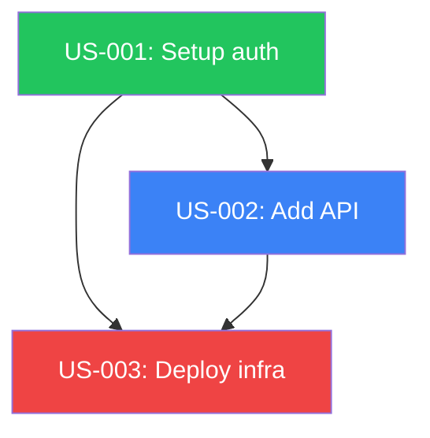

# Story Dependency Visualizer

Visualize the dependency graph for all stories or a specific story subgraph.

## Input

`$ARGUMENTS` is an optional story ID. If provided, show only the subgraph for that story (ancestors and descendants). If empty, show the full graph.

## Data Collection

1. Use Glob to find all `prd/US-*.json` files
2. For each story, extract using jq: `id`, `title`, `dependencies`, `.stage` (top-level field), `priority`
3. Build an adjacency list: for each story, record which stories it depends on and which depend on it
4. If `$ARGUMENTS` is provided, filter to only the transitive ancestors and descendants of that story

## Output Sections

### 1. Story Overview Table

```
| ID     | Title              | Stage    | Priority | Dependencies     |
|--------|--------------------|----------|----------|------------------|
| US-001 | Setup auth         | complete | 1        | —                |
| US-002 | Add API            | build    | 2        | US-001           |
| US-003 | Deploy infra       | blocked  | 3        | US-001, US-002   |
```

### 2. Text Dependency Tree

Show a top-down tree. Stories with no dependencies are roots:

```
US-001 [complete] — Setup auth
  └── US-002 [build] — Add API
      └── US-003 [blocked] — Deploy infra
  └── US-004 [review] — Add logging

US-005 [build] — Standalone task (no dependencies)
```

### 3. Mermaid Flowchart

Generate a Mermaid diagram:



Offer to save it to `flowchart/dependencies.mmd`.

### 4. Critical Path

The longest chain from a root to a leaf. Show:
```
Critical path (length <N>):
  US-001 [complete] → US-002 [build] → US-003 [blocked]
```

Also check `.plan/critical-path.md` if it exists and compare.

### 5. Ready to Run

Stories whose dependencies are ALL `complete` and whose own stage is `build`:
```
Ready to run:
  US-002 — Add API (dependencies satisfied)
  US-005 — Standalone task (no dependencies)
```

### 6. Blocked Chains

Stories that are blocked because an upstream dependency is blocked or incomplete:
```
Blocked chains:
  US-003 [blocked] ← waiting on US-002 [build]
```

## Edge Cases

- No stories: "No stories found in `prd/`. Run planning first."
- Single story with no deps: show it as standalone
- All stories complete: "All stories complete! Dependency graph fully resolved."
- Filtered story not found: list available stories
