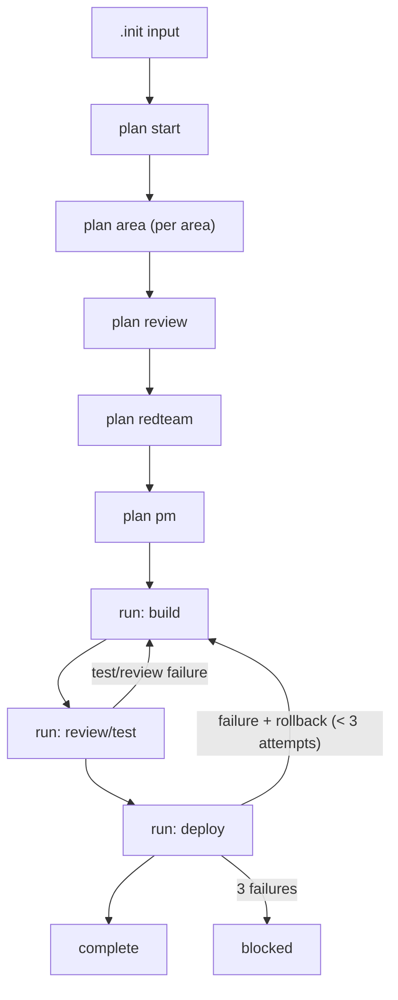

# Ralphio Code Review

Deep review of the Ralphio multi-agent orchestration framework.
Covers shell scripts, agent prompts, planning system, data models, and silent failure paths.

---

## Summary

| Category | Critical | High | Medium | Total |
|---|---|---|---|---|
| Error Handling & Silent Failures | 6 | 7 | 8 | 21 |
| Agent Prompt Design | 3 | 5 | 3 | 11 |
| Planning System & Data Model | 2 | 3 | 5 | 10 |
| **Total** | **11** | **15** | **16** | **42** |

---

## 1. Error Handling & Silent Failures

### CRIT-01: No trap handlers anywhere

**Severity:** Critical
**Files:** `scripts/implement.sh`, `scripts/plan.sh`, `scripts/lib/common.sh`

If the user presses Ctrl+C during an agent run or `set -e` triggers an unexpected exit, no cleanup happens. Temp files in `.temp/` are abandoned. Pipeline state in `.state/pipeline.json` is left showing an agent as "running" forever. For a system that may run for hours orchestrating expensive AI agents, this is the highest-impact gap.

**Fix plan:**

Add trap handlers to `implement.sh` and `plan.sh`:

```bash
cleanup_on_exit() {
    local rc=$?
    if [[ $rc -ne 0 ]]; then
        echo "Pipeline terminated unexpectedly (exit code $rc)." >&2
        printf "Unexpected exit: code=%d time=%s\n" "$rc" "$(date)" >> "${RUN_LOG:-/dev/null}" 2>/dev/null
        update_pipeline_state "error" "crashed" "${current_story:-null}" "${agent:-unknown}" \
            "$(basename "${RUN_DIR:-unknown}")" 2>/dev/null || true
    fi
    rm -f "$TEMP_DIR"/prompt-*.md 2>/dev/null || true
}
trap cleanup_on_exit EXIT
trap 'echo "Interrupted by user." >&2; exit 130' INT TERM
```

Add after `set -euo pipefail` in both `implement.sh` and `plan.sh`. Variables like `$current_story` and `$agent` need to be declared at function scope so they're visible to the trap.

---

### CRIT-02: Non-atomic pipeline state writes

**Severity:** Critical
**File:** `scripts/lib/common.sh:210-227`

`update_pipeline_state()` uses `cat > "$PIPELINE_FILE" << EOF` which truncates the file first, then writes. If the process is killed between truncation and completed write (SIGTERM, OOM, disk full), `pipeline.json` is either empty or contains a partial JSON fragment. Since `update_pipeline_state` is called before every agent run (implement.sh:114), the corruption window is significant.

**Fix plan:**

Write to a temp file, then atomically rename:

```bash
update_pipeline_state() {
  local phase="$1" stage="$2"
  local current_story="${3:-null}" last_agent="${4:-null}" last_run_id="${5:-null}"
  local tmp_file="${PIPELINE_FILE}.tmp.$$"

  jq -n \
    --arg phase "$phase" \
    --arg stage "$stage" \
    --arg story "${current_story//\"/}" \
    --arg agent "$last_agent" \
    --arg run_id "$last_run_id" \
    '{
      phase: $phase,
      stage: $stage,
      currentStory: (if $story == "null" or $story == "" then null else $story end),
      lastAgent: $agent,
      lastRunId: $run_id,
      updatedAt: (now | strftime("%Y-%m-%dT%H:%M:%SZ"))
    }' > "$tmp_file"

  mv "$tmp_file" "$PIPELINE_FILE"
}
```

This also fixes CRIT-03 (JSON injection) since `jq` handles escaping. The callers in `implement.sh:114` and `plan.sh:29,45,52,59,67` no longer need manual quoting of `"\"$story_id\""`.

---

### CRIT-03: JSON injection in state updates

**Severity:** Critical
**File:** `scripts/lib/common.sh:210-227`

Variables are interpolated directly into a JSON heredoc without escaping. `$current_story` is interpolated without quotes when non-null (line 221). If any variable contains double quotes or backslashes, `pipeline.json` becomes malformed. Since `$current_story` is derived from story IDs read via `jq -r '.id'`, a malformed story ID breaks the state file.

Additionally, `$last_agent` on line 222 could contain special characters if runner names are user-configured.

**Fix plan:**

Resolved by the `jq -n` rewrite in CRIT-02's fix plan. The `init_pipeline_state()` function at line 197-206 has the same pattern and should be updated identically.

---

### CRIT-04: Agent execution failures are invisible

**Severity:** Critical
**File:** `scripts/lib/common.sh:281-298` (`run_agent`) and `300-347` (`run_agent_for`)

When an agent command fails (binary not found, API auth error, rate limit, network timeout, crash), `set -e` kills the script immediately. The user gets a raw shell exit with no indication of which agent failed, which story was being processed, or what the exit code was. Pipeline state was already updated at `implement.sh:114` to show the agent as running, but lines 117-131 (post-agent validation) never execute.

**Fix plan:**

Wrap agent execution in `implement.sh` with explicit error handling:

```bash
# implement.sh, replace line 115:
if ! run_agent_for "$agent" "$prompt_file"; then
    local rc=$?
    echo "Error: agent '$agent' failed for $story_id (exit code $rc)." >&2
    printf "Agent failure: %s exit=%d story=%s\n" "$agent" "$rc" "$story_id" >> "$RUN_LOG"
    update_pipeline_state "implementation" "agent_failed" "\"$story_id\"" "$agent" "$(basename "$RUN_DIR")"
    exit $rc
fi
```

Also log agent invocations in `run_agent_for` before execution:

```bash
# common.sh, before "${cmd[@]}" calls at lines 337 and 339:
printf "Executing: %s (agent=%s)\n" "${cmd[*]}" "$agent_name" >> "$RUN_LOG"
```

---

### CRIT-05: jq validation errors swallowed by `>/dev/null 2>&1`

**Severity:** Critical
**File:** `scripts/lib/common.sh:153-168` (`validate_story_schema`), `171-183` (`validate_story_deploy_contract`)

Both validation functions redirect all jq output to /dev/null. Whether the file is invalid JSON, permission denied, missing a field, or jq itself crashes, the user gets the same generic message: `"story schema missing required risk/sizing/deploy safety fields"`.

**Fix plan:**

Separate parse validation from schema validation:

```bash
validate_story_schema() {
  local story_file="$1"
  if [[ ! -f "$story_file" ]]; then
    echo "Error: story file does not exist: $story_file" >&2
    exit 1
  fi
  if ! jq empty "$story_file" 2>/dev/null; then
    echo "Error: $story_file is not valid JSON." >&2
    echo "  Run: jq . '$story_file' to see parse errors." >&2
    exit 1
  fi
  local validation_error
  if ! validation_error=$(jq -e '
    (.riskTier | type == "string" and test("^(low|medium|high)$")) and
    (.sizing | type == "string" and test("^(small|medium|large)$")) and
    (.autonomy | type == "string" and test("^(auto_deploy|gated_deploy)$")) and
    (.requirements | type == "array") and
    (.deploySafety | type == "object") and
    (.deploySafety.strategy | type == "string") and
    (.deploySafety.healthChecks | type == "array") and
    (.deploySafety.rollbackTrigger | type == "string") and
    (.deploySafety.rollbackCommand | type == "string") and
    (.deploySafety.verification | type == "array") and
    (.status.validation | type == "object")
  ' "$story_file" 2>&1); then
    echo "Error: story schema validation failed for $story_file" >&2
    [[ -n "$validation_error" ]] && echo "  Details: $validation_error" >&2
    exit 1
  fi
}
```

Apply the same pattern to `validate_story_deploy_contract`.

---

### CRIT-06: runners.json errors cause silent fallback to wrong model

**Severity:** Critical
**File:** `scripts/lib/common.sh:300-347`

If `runners.json` has a syntax error, missing field, or wrong type, jq fails silently at line 308/310 (suppressed by `>/dev/null 2>&1`), `runner_label` becomes empty, and the function falls through to the builtin `run_agent()` at line 346. The user configured codex for builder but claude runs instead, billing the wrong API with no warning.

The run log shows `Runner: builder -> tool=claude (builtin)` but unless the user reads the log, they have no idea the configured runner was ignored.

**Fix plan:**

Validate `runners.json` upfront and make fallback explicit:

```bash
run_agent_for() {
  local agent_name="$1"
  local prompt_file="$2"

  if [[ -f "$RUNNERS_FILE" ]]; then
    require_jq
    # Validate JSON syntax once
    if ! jq empty "$RUNNERS_FILE" 2>/dev/null; then
      echo "Error: $RUNNERS_FILE is not valid JSON." >&2
      exit 1
    fi

    local runner_label="default"
    if jq -e --arg a "$agent_name" '.[$a].cmd? and (.[$a].cmd|type=="array") and (.[$a].cmd|length>0)' \
        "$RUNNERS_FILE" >/dev/null 2>&1; then
      runner_label="$agent_name"
    elif ! jq -e '.default.cmd? and (.default.cmd|type=="array") and (.default.cmd|length>0)' \
        "$RUNNERS_FILE" >/dev/null 2>&1; then
      echo "Warning: no runner for agent '$agent_name' and no valid default in $RUNNERS_FILE." >&2
      echo "  Falling back to --tool=$TOOL." >&2
      runner_label=""
    fi
    # ... rest of function
  fi
  # ... fallback to run_agent
}
```

Additionally, consider moving the JSON syntax validation to `init_run()` so it fails once at startup rather than on every agent invocation.

---

### HIGH-01: Process substitution jq failure returns false success

**Severity:** High
**File:** `scripts/lib/common.sh:376-393`

`story_dependencies_satisfied()` uses `< <(jq -r '.dependencies[]? // empty' "$story_file")` at line 392. If jq fails (corrupt JSON), the process substitution produces no output, the while loop body never executes, and the function returns 0 (success). A story with corrupt JSON bypasses all dependency checks.

The same pattern exists in `next_story_file()` (line 437, 444) and `all_complete()` (line 457).

**Fix plan:**

Capture jq output into a variable first, check the exit code:

```bash
story_dependencies_satisfied() {
  local story_file="$1"
  local deps_output
  if ! deps_output=$(jq -r '.dependencies[]? // empty' "$story_file" 2>/dev/null); then
    echo "Error: failed to read dependencies from $story_file" >&2
    return 1
  fi

  local dependency dep_file dep_stage
  while IFS= read -r dependency; do
    [[ -z "$dependency" ]] && continue
    dep_file="$PRD_DIR/$dependency.json"
    if [[ ! -f "$dep_file" ]]; then
      return 1
    fi
    if ! dep_stage=$(jq -r '.stage // "build"' "$dep_file" 2>/dev/null); then
      echo "Error: failed to read stage from $dep_file" >&2
      return 1
    fi
    if [[ "$dep_stage" != "complete" ]]; then
      return 1
    fi
  done <<< "$deps_output"
}
```

Apply the same pattern to `next_story_file()` and `all_complete()`.

---

### HIGH-02: No stall detection — stuck story wastes unlimited API credits

**Severity:** High
**File:** `scripts/implement.sh:115-120`

After running an agent, the orchestrator reads the updated stage (line 118) but doesn't check if the stage actually changed. If the agent runs successfully (exit 0) but doesn't update the story JSON (misunderstood prompt, internal error), `$updated_stage` equals `$stage`, and the story loops forever in the same stage. With `MAX_ITERATIONS=0` (default, unlimited), this burns API credits indefinitely.

**Fix plan:**

Track consecutive same-stage iterations per story:

```bash
# implement.sh, add after line 120 (stage="$updated_stage"):
if [[ "$updated_stage" == "$stage" ]]; then
    stall_count=$((${stall_count:-0} + 1))
    if [[ "$stall_count" -ge 3 ]]; then
        echo "Error: story $story_id stuck at stage '$stage' for $stall_count iterations." >&2
        echo "  Agent is not advancing the story. Review agent output and prd/$story_id.json." >&2
        exit 1
    fi
    echo "Warning: story $story_id did not advance from stage '$stage' (attempt $stall_count)." >&2
else
    stall_count=0
fi
```

Declare `stall_count=0` before the while loop. Reset when a different story is selected.

---

### HIGH-03: Deployment retry counter relies on agent honesty

**Severity:** High
**File:** `scripts/implement.sh:122-130`

The deploy attempt counter at line 125 (`jq -r '.status.deploy.attempts // 0'`) must be incremented by the AI deploy agent itself. If the agent doesn't increment it (bug, crash, misunderstood instructions), deploys retry forever since `attempts` stays at 0 and never reaches 3.

**Fix plan:**

The orchestrator should increment the counter itself before running the deploy agent:

```bash
# implement.sh, add before run_agent_for when agent == "deploy":
if [[ "$agent" == "deploy" ]]; then
    local current_attempts
    current_attempts=$(jq -r '.status.deploy.attempts // 0' "$story_file")
    if [[ "$current_attempts" -ge 3 ]]; then
        echo "Deployment failed after 3 attempts for $story_id. Manual review required." >&2
        # Set story to blocked
        jq '.stage = "blocked"' "$story_file" > "${story_file}.tmp" && mv "${story_file}.tmp" "$story_file"
        exit 1
    fi
    # Increment attempts before running agent
    jq '.status.deploy.attempts += 1' "$story_file" > "${story_file}.tmp" && mv "${story_file}.tmp" "$story_file"
fi
```

Remove the post-agent attempts check at lines 122-131 (the orchestrator now owns this logic).

---

### HIGH-04: `common.sh` lacks its own `set -euo pipefail`

**Severity:** High
**File:** `scripts/lib/common.sh:1`

The file begins with `#!/bin/bash` and no safety flags. While it inherits flags from sourcing scripts, this is fragile. Process substitutions within functions don't inherit `errexit` in bash versions before 4.4, which is the default bash on macOS. This means jq failures inside `< <(jq ...)` patterns are silently ignored.

**Fix plan:**

Add `set -euo pipefail` at line 2 of `common.sh`. Also add `shopt -s inherit_errexit` (bash 4.4+) to ensure subshells inherit errexit:

```bash
#!/bin/bash
set -euo pipefail
shopt -s inherit_errexit 2>/dev/null || true
```

The `2>/dev/null || true` handles older bash versions gracefully. However, the real fix for process substitution safety is HIGH-01 (capturing jq output into variables).

---

### HIGH-05: `--reset` silently ignores deletion failures

**Severity:** High
**File:** `scripts/lib/common.sh:191-193`

```bash
rm -rf "$STATE_DIR"/* "$LOG_ROOT"/* "$TEMP_DIR"/* 2>/dev/null || true
```

If files are locked, on a read-only filesystem, or owned by root, deletion silently fails. The script creates a new pipeline state as if the reset succeeded, but stale state files persist. The user passes `--reset` expecting a clean slate, but old state corrupts behavior.

**Fix plan:**

Verify the reset actually worked:

```bash
if [[ "$RESET" == "true" ]]; then
    rm -rf "$STATE_DIR"/* "$LOG_ROOT"/* "$TEMP_DIR"/* 2>/dev/null || true
    mkdir -p "$STATE_DIR" "$LOG_ROOT" "$TEMP_DIR"
    # Verify state is actually clean
    if [[ -f "$PIPELINE_FILE" ]]; then
        echo "Warning: --reset failed to clear $PIPELINE_FILE. Check permissions." >&2
    fi
fi
```

---

### HIGH-06: `|| true` swallows jq errors on context file extraction

**Severity:** High
**File:** `scripts/implement.sh:102`

```bash
extra_files=$(jq -r '.context.files[]? // empty' "$story_file" || true)
```

If `$story_file` is malformed JSON, jq fails but returns empty output. The agent runs without critical context files that the story specification requires. The `|| true` was likely added to handle "no context files" but it also suppresses genuine errors.

**Fix plan:**

Use jq's `// empty` properly (which already handles missing fields) and remove `|| true`:

```bash
local extra_files
if ! extra_files=$(jq -r '.context.files[]? // empty' "$story_file" 2>/dev/null); then
    echo "Warning: failed to read context.files from $story_file" >&2
    extra_files=""
fi
```

---

### HIGH-07: Story dependency validation is not transitive

**Severity:** High
**File:** `scripts/lib/common.sh:376-393`

If story A depends on B, and B depends on C, the function only checks A's direct dependencies. If B is marked `complete` but C is not, A is allowed to proceed. In a correctly functioning system B shouldn't be complete if C isn't, but agent errors or manual edits could create this state.

**Fix plan:**

Add recursive checking or validate the full dependency graph at startup:

```bash
# In doctor.sh, add a new check:
check_dependency_graph() {
    require_jq
    shopt -s nullglob
    local story dep dep_file
    for story in "$SCRIPT_DIR"/prd/*.json; do
        local story_id
        story_id=$(jq -r '.id' "$story")
        while IFS= read -r dep; do
            [[ -z "$dep" ]] && continue
            dep_file="$PRD_DIR/$dep.json"
            if [[ ! -f "$dep_file" ]]; then
                printf "Broken dependency: %s depends on %s (file not found)\n" "$story_id" "$dep"
                return 1
            fi
            # Check for circular: does dep depend on story_id?
            if jq -e --arg id "$story_id" '.dependencies[]? == $id' "$dep_file" >/dev/null 2>&1; then
                printf "Circular dependency: %s <-> %s\n" "$story_id" "$dep"
                return 1
            fi
        done < <(jq -r '.dependencies[]? // empty' "$story")
    done
}
```

Register this check in doctor.sh's check sequence.

---

### MED-01: Missing argument validation for `--tool`, `--area`, `--story`, `--runners`

**Severity:** Medium
**File:** `scripts/lib/common.sh:38-53`

If `--tool` is the last argument with no value, `$2` is unset. With `set -u`, this produces `line 39: $2: unbound variable`. The `--approve-deploy` case (line 59) has proper validation, but `--tool`, `--area`, `--story`, and `--runners` do not.

**Fix plan:**

Apply the same validation pattern used for `--approve-deploy` to all flags:

```bash
--tool)
    if [[ -z "${2:-}" || "${2:-}" == --* ]]; then
        echo "Error: --tool requires a value (claude|codex|gemini)." >&2
        exit 1
    fi
    TOOL="$2"
    shift 2
    ;;
```

Repeat for `--area`, `--story`, `--runners`, `--max-iterations`.

---

### MED-02: Planning gate depends on `rg` without checking availability

**Severity:** Medium
**File:** `scripts/lib/common.sh:125`

```bash
if rg -n -i '\b(TODO|TBD|FIXME)\b' "$RUNBOOK" >/dev/null 2>&1; then
```

If `rg` is not installed, the `>/dev/null 2>&1` suppresses the "command not found" error and the `if` condition is false (non-zero exit). The planning gate thinks the runbook has no TODOs even though it was never checked. Later `rg` calls at lines 130-143 are NOT suppressed, so they would fail with confusing errors.

**Fix plan:**

Add `require_rg` at the top of `validate_planning_exit_gate`:

```bash
validate_planning_exit_gate() {
    if ! command -v rg >/dev/null 2>&1; then
        echo "Error: ripgrep (rg) is required for planning gate validation." >&2
        exit 1
    fi
    # ... rest of function
}
```

---

### MED-03: Race condition — no file locking for concurrent runs

**Severity:** Medium
**File:** `scripts/lib/common.sh:210-227`

If multiple instances of the orchestrator run concurrently (no locking mechanism prevents this), one process can overwrite another's state. This is especially dangerous for deployment stages.

**Fix plan:**

Add a lock file mechanism in `init_run()`:

```bash
LOCK_FILE="$STATE_DIR/.pipeline.lock"

acquire_lock() {
    if ! mkdir "$LOCK_FILE" 2>/dev/null; then
        echo "Error: another orchestrator instance is running (lock: $LOCK_FILE)." >&2
        echo "  If this is stale, remove $LOCK_FILE manually." >&2
        exit 1
    fi
    trap 'rm -rf "$LOCK_FILE"' EXIT
}
```

Call `acquire_lock` at the beginning of `run_implementation` and `run_plan`. Using `mkdir` is atomic on all filesystems.

---

### MED-04: `validate_story_stage_transition` missing wildcard case

**Severity:** Medium
**File:** `scripts/lib/common.sh:349-374`

If `from_stage` is anything other than `build`, `review`, `test`, or `deploy` (e.g., `complete`, `blocked`, empty string from jq failure), the `case` statement matches nothing and returns success. An invalid stage silently passes validation.

**Fix plan:**

Add a default case:

```bash
    *)
        echo "Error: unexpected from_stage '$from_stage' for $story_file" >&2
        exit 1
        ;;
```

---

### MED-05: `nullglob` changed globally, never restored

**Severity:** Medium
**File:** `scripts/lib/common.sh:433, 454`

`next_story_file()` and `all_complete()` both set `shopt -s nullglob` but never restore the previous state. This changes global shell behavior and could cause subtle bugs if a later glob pattern matches nothing.

**Fix plan:**

Use a subshell, or save and restore:

```bash
next_story_file() {
    local best_file="" best_priority=999999
    local nullglob_was_set=false
    shopt -q nullglob && nullglob_was_set=true
    shopt -s nullglob
    for f in "$PRD_DIR"/*.json; do
        # ... existing logic
    done
    "$nullglob_was_set" || shopt -u nullglob
    echo "$best_file"
}
```

---

### MED-06: `doctor.sh` check_planning_gate suppresses failure reasons

**Severity:** Medium
**File:** `scripts/doctor.sh:190-192`

```bash
check_planning_gate() {
    validate_planning_exit_gate >/dev/null 2>&1
}
```

`validate_planning_exit_gate` produces detailed error messages ("runbook still contains TODO/TBD/FIXME placeholders"), but they're all suppressed. Even with `--verbose`, the `run_check` wrapper sees empty output. The user sees `[FAIL] Planning exit gate passes` with no information about which check failed.

**Fix plan:**

Let stderr through:

```bash
check_planning_gate() {
    validate_planning_exit_gate 2>&1
}
```

---

### MED-07: `doctor.sh` reports only the first invalid JSON file

**Severity:** Medium
**File:** `scripts/doctor.sh:111-120`

`check_json_files()` calls `jq empty` sequentially. On the first failure, `set -e` exits the function. If multiple files are invalid, only the first one is reported.

**Fix plan:**

Accumulate all failures:

```bash
check_json_files() {
    local failed=0
    for f in "$SCRIPT_DIR/agents/runners.json" "$SCRIPT_DIR/agents/runners.example.json"; do
        if ! jq empty "$f" 2>&1; then
            failed=1
        fi
    done
    shopt -s nullglob
    for story in "$SCRIPT_DIR"/prd/*.json; do
        if ! jq empty "$story" 2>&1; then
            failed=1
        fi
    done
    return $failed
}
```

---

### MED-08: Gemini prompt via command-line argument can exceed ARG_MAX

**Severity:** Medium
**File:** `scripts/lib/common.sh:290-292`

```bash
gemini -p "$(cat "$prompt_file")" --model "${GEMINI_MODEL:-gemini-3-pro-preview}"
```

For large prompt files, `$(cat "$prompt_file")` expands the entire file as a single command-line argument. This can exceed the system's `ARG_MAX` limit (256KB on macOS). The `claude` and `codex` branches correctly use stdin.

**Fix plan:**

Check if gemini supports stdin. If yes, use stdin. If no, check file size and warn:

```bash
gemini)
    if [[ $(wc -c < "$prompt_file") -gt 200000 ]]; then
        echo "Warning: prompt file exceeds 200KB, gemini may fail with ARG_MAX." >&2
    fi
    gemini -p "$(cat "$prompt_file")" --model "${GEMINI_MODEL:-gemini-3-pro-preview}"
    ;;
```

Ideally, switch to a file-based argument if gemini supports it.

---

### MED-09: `--resume` flag parsed but never used

**Severity:** Medium
**File:** `scripts/lib/common.sh:70-72, 249`

The `--resume` flag is parsed and stored in `$RESUME`, logged at line 249, but never affects behavior. The pipeline state has `currentStory` and `lastAgent` fields designed for resume, but `implement.sh` selects stories from scratch every time.

**Fix plan:**

Either implement resume or remove the flag. To implement:

```bash
# implement.sh, before the main while loop:
if [[ "$RESUME" == "true" && -f "$PIPELINE_FILE" ]]; then
    local resume_story
    resume_story=$(jq -r '.currentStory // empty' "$PIPELINE_FILE")
    if [[ -n "$resume_story" && "$resume_story" != "null" ]]; then
        echo "Resuming from story: $resume_story"
        STORY_ID="$resume_story"
    fi
fi
```

---

### MED-10: No cleanup of temporary prompt files

**Severity:** Medium
**File:** `scripts/lib/common.sh:229-252`

`init_run()` creates `$TEMP_DIR` but prompt files (`prompt-${agent}-${story_id}.md`) accumulate across runs. Over time this could fill disk space, and old prompt files may contain sensitive context.

**Fix plan:**

Clean up temp files from previous runs at the start of `init_run()`:

```bash
init_run() {
    # Clean stale prompt files from previous runs
    rm -f "$TEMP_DIR"/prompt-*.md 2>/dev/null || true
    # ... rest of init_run
}
```

Also add cleanup to the trap handler from CRIT-01.

---

### MED-11: `build_prompt` does not verify agent file exists

**Severity:** Medium
**File:** `scripts/lib/common.sh:266-279`

If `$agent_file` (e.g., `agents/builder.md`) doesn't exist, `cat` fails with a raw error and `set -e` kills the script. The user sees `cat: agents/builder.md: No such file or directory` with no context about which agent was being set up or which story was being processed.

**Fix plan:**

```bash
build_prompt() {
    local agent_file="$1"
    local prompt_file="$2"
    shift 2
    local files=("$@")

    if [[ ! -f "$agent_file" ]]; then
        echo "Error: agent prompt file not found: $agent_file" >&2
        echo "  Ensure the file exists in the agents/ directory." >&2
        exit 1
    fi

    cat "$agent_file" > "$prompt_file"
    # ... rest of function
}
```

---

### MED-12: Date command failure produces empty JSON value

**Severity:** Medium
**File:** `scripts/lib/common.sh:204, 224`

If `date` fails or the system clock is wrong, the `$(date -u ...)` subshell produces an empty string, resulting in `"updatedAt": ""` in the JSON. Combined with the heredoc approach (CRIT-03), this could cause issues.

**Fix plan:**

Resolved by the `jq -n` rewrite in CRIT-02 which uses `jq`'s built-in `now | strftime(...)`. As a belt-and-suspenders measure:

```bash
local ts
ts=$(date -u '+%Y-%m-%dT%H:%M:%SZ') || ts="1970-01-01T00:00:00Z"
```

---

### MED-13: No validation of RUNNERS_FILE path safety

**Severity:** Medium
**File:** `scripts/lib/common.sh:78-80`

Users can specify arbitrary `--runners` file paths. This allows reading arbitrary files on the system and, combined with the command execution in `run_agent_for`, could lead to command injection via a malicious JSON file.

**Fix plan:**

Validate the runners file:

```bash
--runners)
    if [[ -z "${2:-}" || "${2:-}" == --* ]]; then
        echo "Error: --runners requires a file path." >&2
        exit 1
    fi
    if [[ ! -f "$2" ]]; then
        echo "Error: runners file not found: $2" >&2
        exit 1
    fi
    if [[ -L "$2" ]]; then
        echo "Error: runners file must not be a symlink: $2" >&2
        exit 1
    fi
    RUNNERS_FILE="$2"
    shift 2
    ;;
```

---

## 2. Agent Prompt Design

### CRIT-07: Reviewer and red-team agents have overlapping responsibilities

**Severity:** Critical
**File:** `agents/reviewer.md:1-2, 15-16` vs `agents/red-team.md:1, 13-18`

The reviewer is described as "the planning reviewer and red-team challenger" (line 1) and its task #2 is "Run a red-team pass: challenge scale assumptions, failure handling, security boundaries, and rollback feasibility" (lines 15-16). The separate red-team agent does the exact same work (lines 13-18). Running both agents means redundant work. Running only one means either the red-team pass is missed (if reviewer only) or work-breakdown.md is never produced (if red-team only).

**Fix plan:**

Split responsibilities cleanly. In `agents/reviewer.md`, remove the red-team overlap:

```markdown
You are the planning reviewer.

...

Tasks:
1. Run a consistency review:
   - find missing detail, contradictions, unresolved dependencies, weak assumptions.
2. Ask only gap-closing questions needed to remove blockers.
3. Keep area status aligned in `.plan/areas.md`:
   - if gaps remain, area returns to `probing` or `in_review`.
   - only mark `approved` when checklist passes and no critical gaps remain.
4. When all areas are approved, produce `.plan/work-breakdown.md` ...
5. Produce `.plan/traceability.md` ...
```

Leave `agents/red-team.md` focused on adversarial stress-testing only.

---

### CRIT-08: Builder agent has no build success criteria

**Severity:** Critical
**File:** `agents/builder.md:21-23`

The builder says "If build succeeds" and "If build fails" but never defines what these mean. No reference to `.plan/runbook.md` build commands. Different AI models will interpret "build succeeds" differently. An agent could advance to review stage with broken code if it considers "I wrote the code" to be success.

**Fix plan:**

Replace lines 21-23 with explicit criteria:

```markdown
Stage guidance:
- Run the build command from `.plan/runbook.md` (build section) unless the story overrides it.
- If the build command exits with code 0, set `status.build.passes = true` and `stage = "review"`.
- If the build command exits non-zero, keep `stage = "build"`, document the failure in `status.build.notes`, and explain what needs fixing.
- If no build command is defined, treat "code compiles and passes basic lint" as the success criteria.
- Record the build command and its output in `status.build.notes`.
```

---

### CRIT-09: review vs test stage ambiguity

**Severity:** Critical
**Files:** `scripts/implement.sh:69`, `scripts/lib/common.sh:361`, `agents/reviewer-test.md`

The code treats `review` and `test` as equivalent stages (`review|test` in bash case statements). But no documentation or agent prompt defines when to use which. Builder advances to `review` (builder.md:22). The `test` stage value exists as a status block in story JSON (US-001.json:32) but is never explicitly set by any agent.

**Fix plan:**

Decide: `test` is a status block, not a stage. Document and enforce:

1. In `agents/reviewer-test.md`, add:
   ```markdown
   Note: The story stage should be "review" when you receive it (from builder).
   Always transition to "deploy" or back to "build". Never set stage to "test".
   ```

2. In README.md, clarify that valid stage values are: `build`, `review`, `deploy`, `complete`, `blocked`.

3. In `validate_story_stage_transition`, keep `review|test)` for backward compatibility but log a warning for `test`:
   ```bash
   review|test)
       if [[ "$from_stage" == "test" ]]; then
           echo "Warning: stage 'test' is deprecated, use 'review'." >&2
       fi
       # ... existing validation
   ```

---

### HIGH-08: Deploy agent told to check approval that orchestrator already checked

**Severity:** High
**File:** `agents/deploy.md:24-25`

The deploy agent is told: "If story `autonomy = "gated_deploy"`, require explicit user approval before executing deploy." But the orchestrator validates this BEFORE invoking the agent (implement.sh:59-62). The agent has no mechanism to check approval status. This contradictory instruction wastes tokens and may cause the agent to refuse to deploy.

**Fix plan:**

Replace lines 24-25:

```markdown
- If you are invoked for a gated_deploy story, approval has already been verified by the orchestrator. Proceed with deployment.
- The orchestrator enforces gated approval before invoking you; you do not need to check again.
```

---

### HIGH-09: PM agent has no story ID generation rules

**Severity:** High
**File:** `agents/pm.md:11`

The PM agent creates `prd/US-XXX.json` but has no guidance on how to generate story IDs. Should they be sequential? By area? What if stories already exist?

**Fix plan:**

Add before the Tasks section in `agents/pm.md`:

```markdown
Story ID rules:
- Use format `US-001`, `US-002`, etc. with zero-padded 3-digit sequential numbers.
- Check existing `prd/*.json` files and use the next available number.
- Assign IDs in dependency order (lower numbers for stories that others depend on).
- Never reuse or skip IDs.
```

---

### HIGH-10: context-pack.md is an empty template that serves no purpose

**Severity:** High
**File:** `agents/context-pack.md`

This file is a template with empty fields (Goal, Files, Summary, etc.) but is never populated by any script. The `build_prompt` function generates file lists dynamically. If agents reference this file expecting useful information, they get empty fields and waste context window.

**Fix plan:**

Option A (recommended): Delete `agents/context-pack.md`. The dynamic context packs in `.log/run-*/context-pack.md` serve the audit purpose.

Option B: Populate it dynamically in `build_prompt()` using the template as a format, filling in the goal, files, and constraints for each agent run.

---

### HIGH-11: Area agent lock status has no enforcement mechanism

**Severity:** High
**File:** `agents/area-agent.md:37`

"Mark `locked` only after user confirmation" is ambiguous. The agent has no way to get user confirmation. No enforcement mechanism prevents premature locking. If locked incorrectly, there's no documented way to unlock.

**Fix plan:**

Replace line 37:

```markdown
- Do not set status to `locked`. The orchestrator or user will lock areas after final validation.
- If an area is already `locked`, do not modify its area file or status.
```

---

### HIGH-12: Reviewer-test has conflicting fix responsibilities

**Severity:** High
**File:** `agents/reviewer-test.md:10, 20`

Line 10 says "Review code and fix issues if needed." Line 20 says "If review or tests fail, set `stage = "build"`" (sending back to builder). When the reviewer-test finds issues, should it fix them or send them back? This ambiguity can cause infinite build->review->build loops.

**Fix plan:**

Replace tasks section:

```markdown
Tasks:
1. Review code for quality, security, and correctness issues.
2. For minor issues (style, simple bugs, missing docs): fix them directly and commit on the same branch.
3. For major issues (wrong approach, missing requirements, architectural problems): do NOT fix them. Document clearly in `status.review.notes` and set `stage = "build"`.
4. Add or update tests to verify all requirements.
5. Run tests and record results.
6. Update prd/US-XXX.json status and stage.
```

---

### MED-14: Planner .init/ protection is prompt-only

**Severity:** Medium
**File:** `agents/planner.md:23`

Rule says "Do not edit `.init/`" but there's no technical enforcement. Agents with write access could accidentally modify the read-only input directory.

**Fix plan:**

Strengthen the prompt language:

```markdown
- `.init/` is **read-only**. Never create, modify, or delete any files in `.init/`. All output goes in `.plan/`.
```

Additionally, add a post-agent check in `plan.sh` after the planner runs:

```bash
# After run_agent_for "planner":
if ! git diff --quiet -- .init/ 2>/dev/null; then
    echo "Warning: .init/ was modified by the planner agent. Restoring." >&2
    git checkout -- .init/
fi
```

---

### MED-15: runners.json has non-functional model names

**Severity:** Medium
**File:** `agents/runners.json:25, 35`

`gpt-5.2` (line 25) and `gemini-3-pro-preview` (line 35) are placeholder model names that don't exist. Users will get runtime errors if they try to use this configuration as-is.

**Fix plan:**

Update to real model names or clearly mark as examples:

Option A: Use real defaults in `runners.json` (e.g., `claude-opus-4-6` for all agents).
Option B: Rename `runners.json` to `runners.example.json` and have the scripts look for `runners.json` which users create by copying and editing.

---

### MED-16: No cross-agent context continuity mechanism

**Severity:** Medium
**Files:** All agent files, `scripts/lib/common.sh:266-279`

Each agent invocation is completely stateless. Only the file system connects agents. `build_prompt` only includes file paths, not a context summary. Important decisions or constraints discovered by one agent may not be picked up by the next.

**Fix plan:**

Add a "handoff notes" section to the prompt builder. After building the file list, append:

```bash
# In build_prompt(), after the file list:
if [[ -f "$RUN_DIR/handoff-notes.md" ]]; then
    printf "\n## Handoff Notes from Previous Agents\n" >> "$prompt_file"
    cat "$RUN_DIR/handoff-notes.md" >> "$prompt_file"
fi
printf "\nIf you have important context for the next agent, append it to: %s\n" \
    "$RUN_DIR/handoff-notes.md" >> "$prompt_file"
```

Add instruction to each agent prompt:

```markdown
If you discover constraints, blockers, or important context that the next agent should know,
append a brief note to the handoff notes file referenced in the context pack.
```

---

## 3. Planning System & Data Model

### CRIT-10: No story JSON template exists

**Severity:** Critical
**File:** Missing from `.plan/templates/` and `scripts/bootstrap-plan.sh`

The PM agent must create `prd/US-XXX.json` following a specific schema, but there's no template file. The only reference is the existing `US-001.json` which has empty fields. `bootstrap-plan.sh` creates all planning templates but no story template. `validate_story_schema` enforces fields, but the PM agent has to guess the structure.

**Fix plan:**

Add to `bootstrap-plan.sh`:

```bash
write_if_missing "$ROOT_DIR/.plan/templates/story.template.json" <<'EOF'
{
  "id": "US-XXX",
  "title": "",
  "area": "",
  "priority": 1,
  "stage": "build",
  "riskTier": "low|medium|high",
  "sizing": "small|medium|large",
  "autonomy": "auto_deploy|gated_deploy",
  "description": "",
  "requirements": ["REQ-001"],
  "acceptanceCriteria": [],
  "dependencies": [],
  "deploySafety": {
    "strategy": "",
    "healthChecks": [],
    "rollbackTrigger": "",
    "rollbackCommand": "",
    "verification": []
  },
  "context": {
    "workBreakdown": ".plan/work-breakdown.md",
    "traceability": ".plan/traceability.md",
    "runbook": ".plan/runbook.md",
    "areaDoc": ".plan/areas/<area>.md",
    "files": []
  },
  "status": {
    "planning": { "passes": true, "notes": "" },
    "build": { "passes": false, "branch": "", "commit": "", "notes": "" },
    "review": { "passes": false, "branch": "", "commit": "", "notes": "" },
    "test": { "passes": false, "command": "", "result": "", "notes": "" },
    "validation": {
      "requirementsImplemented": [],
      "requirementsVerified": [],
      "notes": ""
    },
    "deploy": { "passes": false, "attempts": 0, "target": "", "result": "", "rollback": "", "notes": "" }
  }
}
EOF
```

Reference this template in `agents/pm.md`:

```markdown
Use `.plan/templates/story.template.json` as the schema reference for all story JSON files.
```

---

### CRIT-11: Planning gate only checks runbook for TODOs

**Severity:** Critical
**File:** `scripts/lib/common.sh:125-128`, `scripts/bootstrap-plan.sh:151`

The planning exit gate checks for `TODO/TBD/FIXME` only in the runbook (line 125). But the dependencies template contains `"1. TODO: define sequence"` (bootstrap-plan.sh:151) which would pass the gate. Other planning artifacts could also contain unresolved TODOs.

**Fix plan:**

Extend the TODO check to all critical planning artifacts:

```bash
# Replace lines 125-128 with:
local -a checked_files=("$RUNBOOK" "$SCRIPT_DIR/$DEPENDENCIES_REL" "$SCRIPT_DIR/$WORK_BREAKDOWN_REL")
for checked_file in "${checked_files[@]}"; do
    if rg -n -i '\b(TODO|TBD|FIXME)\b' "$checked_file" >/dev/null 2>&1; then
        echo "Planning exit gate failed: $checked_file still contains TODO/TBD/FIXME placeholders." >&2
        exit 1
    fi
done
```

---

### HIGH-13: Deploy safety validation accepts placeholder values

**Severity:** High
**File:** `scripts/lib/common.sh:171-183`

`validate_story_deploy_contract` checks that deploy safety fields are non-empty, but doesn't check for placeholder text. A story could pass with `"rollbackCommand": "TODO"` or `"strategy": "TBD"`.

**Fix plan:**

Add semantic validation:

```bash
validate_story_deploy_contract() {
    local story_file="$1"
    # ... existing length checks ...

    # Check for placeholder text in string fields
    local placeholder_check
    placeholder_check=$(jq -r '
        [.deploySafety.strategy, .deploySafety.rollbackTrigger, .deploySafety.rollbackCommand]
        | map(select(test("(?i)^\\s*(TODO|TBD|FIXME|placeholder)\\s*$")))
        | length
    ' "$story_file")
    if [[ "$placeholder_check" -gt 0 ]]; then
        echo "Error: deploy safety contract contains placeholder text in $story_file." >&2
        exit 1
    fi
}
```

---

### HIGH-14: No circular dependency detection

**Severity:** High
**File:** `scripts/lib/common.sh:376-393`, `scripts/doctor.sh`

`story_dependencies_satisfied()` checks direct dependencies but doesn't detect cycles. Story A depending on B depending on A creates a deadlock where neither can ever run. No validation exists anywhere in the codebase.

**Fix plan:**

Add the `check_dependency_graph` function described in HIGH-07 to `doctor.sh`. For deeper cycle detection, implement a depth-first search:

```bash
check_no_cycles() {
    require_jq
    shopt -s nullglob
    local -A visiting=() visited=()

    dfs() {
        local id="$1"
        if [[ -n "${visiting[$id]:-}" ]]; then
            printf "Circular dependency detected involving: %s\n" "$id"
            return 1
        fi
        [[ -n "${visited[$id]:-}" ]] && return 0
        visiting[$id]=1
        local dep_file="$PRD_DIR/$id.json"
        local dep
        while IFS= read -r dep; do
            [[ -z "$dep" ]] && continue
            dfs "$dep" || return 1
        done < <(jq -r '.dependencies[]? // empty' "$dep_file")
        unset 'visiting[$id]'
        visited[$id]=1
    }

    for f in "$PRD_DIR"/*.json; do
        local story_id
        story_id=$(jq -r '.id' "$f")
        dfs "$story_id" || return 1
    done
}
```

---

### HIGH-15: Pipeline state has unused fields, resume not implemented

**Severity:** High
**File:** `.state/pipeline.json`, `scripts/implement.sh`

The pipeline state tracks `currentStory` and `lastAgent` but `implement.sh` never reads these for decision-making. The `--resume` flag exists but does nothing (MED-09). This means every run starts from scratch, potentially re-running completed work.

**Fix plan:**

See MED-09 for resume implementation. Also document in README.md whether state is functional or audit-only:

```markdown
## Pipeline State
The `.state/pipeline.json` file tracks the current state for:
- Audit logging (which agent last ran, on which story)
- Resume capability (use `--resume` to continue from last story)
```

---

### MED-17: dependencies.md template has TODO that passes planning gate

**Severity:** Medium
**File:** `scripts/bootstrap-plan.sh:151`

The dependencies template contains `"1. TODO: define sequence"` in the Critical Path section. The planning gate (common.sh:125) only checks the runbook for TODOs, so this passes validation. An operator could reach implementation with an undefined critical path.

**Fix plan:**

Covered by CRIT-11. Additionally, update the template itself to not contain TODO:

```markdown
## Critical Path

1. (Define the critical path sequence here.)
```

---

### MED-18: No story schema version field

**Severity:** Medium
**File:** `prd/US-001.json`

The story JSON has no version field. Schema evolution over time will break existing stories with no migration path.

**Fix plan:**

Add `"schemaVersion": "1"` as the first field in the story template (CRIT-10). Add a version check in `validate_story_schema`:

```bash
local schema_version
schema_version=$(jq -r '.schemaVersion // "0"' "$story_file")
if [[ "$schema_version" != "1" ]]; then
    echo "Warning: story $story_file has schema version $schema_version (expected 1)." >&2
fi
```

---

### MED-19: No requirement ID format validation in story JSON

**Severity:** Medium
**File:** `scripts/lib/common.sh:157`

The planning gate validates that `REQ-[0-9]{3}` exists in work-breakdown.md (line 130), but `validate_story_schema` only checks `(.requirements | type == "array")` (line 157). Story requirements could contain arbitrary strings that don't match the requirement ID format.

**Fix plan:**

Add format validation:

```bash
# In validate_story_schema, replace line 157:
(.requirements | type == "array" and all(test("^REQ-[0-9]{3}$"))) and
```

---

### MED-20: No story tracker template

**Severity:** Medium
**File:** Missing from `.plan/templates/`

The PM agent creates `prd/US-XXX.md` trackers but has no template. The existing `US-001.md` is a bare list of field names with no structure.

**Fix plan:**

Add to `bootstrap-plan.sh`:

```bash
write_if_missing "$ROOT_DIR/.plan/templates/story-tracker.template.md" <<'EOF'
# US-XXX: <title>

**Area:** <area>
**Priority:** <N>
**Risk Tier:** low|medium|high
**Sizing:** small|medium|large
**Stage:** build

## Requirements
- REQ-XXX: <requirement description>

## Acceptance Criteria
- [ ] <criterion>

## Build Notes

## Review Notes

## Test Results

## Deploy Results

## Requirement Verification
- REQ-XXX: <verification evidence>
EOF
```

Reference in `agents/pm.md`:

```markdown
Use `.plan/templates/story-tracker.template.md` as the format reference for tracker files.
```

---

### MED-21: Workflow diagram doesn't show backward transitions

**Severity:** Medium
**File:** `flowchart/workflow.mmd`

The mermaid diagram shows linear flow (BUILD -> TEST -> DEPLOY -> DONE) with only one backward edge (DEPLOY failure -> BUILD). The actual implementation allows review -> build (test failures) and deploy -> blocked (3 failures). The diagram understates the complexity.

**Fix plan:**

Update `flowchart/workflow.mmd`:



---

## Fix Priority Roadmap

### Phase 1: Safety (do first)
These prevent data loss, infinite loops, and silent failures.

| Issue | Effort | Impact |
|---|---|---|
| CRIT-01: Add trap handlers | Small | Prevents undiagnosed crashes |
| CRIT-02: Atomic state writes (also fixes CRIT-03) | Small | Prevents state corruption |
| CRIT-04: Agent failure logging | Small | Makes failures diagnosable |
| HIGH-02: Stall detection | Small | Prevents infinite API billing |
| HIGH-03: Orchestrator-owned deploy counter | Medium | Prevents infinite deploy retries |
| MED-03: File locking | Small | Prevents concurrent corruption |

### Phase 2: Error Reporting (do second)
These make failures actionable instead of mysterious.

| Issue | Effort | Impact |
|---|---|---|
| CRIT-05: Separate parse vs schema validation | Medium | Actionable error messages |
| CRIT-06: Explicit runners.json fallback warning | Small | Prevents wrong-model billing |
| HIGH-01: Fix process substitution jq failures | Medium | Prevents false dependency satisfaction |
| HIGH-04: Add `set -euo pipefail` to common.sh | Small | Defense in depth |
| MED-01: Argument validation | Small | Better UX on bad input |
| MED-02: Require rg in planning gate | Small | Prevents false gate pass |
| MED-06: Unsuppress planning gate errors | Small | Actionable doctor output |

### Phase 3: Agent Prompt Quality (do third)
These prevent agent confusion and wasted AI cycles.

| Issue | Effort | Impact |
|---|---|---|
| CRIT-07: Split reviewer/red-team responsibilities | Small | Eliminates redundant work |
| CRIT-08: Builder success criteria | Small | Prevents premature stage advance |
| CRIT-09: Clarify review vs test stage | Small | Eliminates stage ambiguity |
| HIGH-08: Fix deploy approval contradiction | Small | Prevents agent refusal |
| HIGH-09: PM story ID rules | Small | Consistent story generation |
| HIGH-12: Reviewer-test fix responsibilities | Small | Prevents build-review loops |

### Phase 4: Data Model & Templates (do fourth)
These ensure consistent data across the system.

| Issue | Effort | Impact |
|---|---|---|
| CRIT-10: Story JSON template | Small | Consistent story schema |
| CRIT-11: Extend TODO checking | Small | Prevents incomplete planning |
| HIGH-10: Remove/populate context-pack.md | Small | Cleaner agent context |
| HIGH-14: Circular dependency detection | Medium | Prevents deadlocks |
| MED-18: Schema version field | Small | Future-proofs schema |
| MED-19: Requirement ID format validation | Small | Consistent traceability |
| MED-20: Story tracker template | Small | Consistent tracker format |

### Phase 5: Nice-to-Have
Lower priority improvements.

| Issue | Effort | Impact |
|---|---|---|
| HIGH-05: --reset verification | Small | More reliable reset |
| HIGH-06: || true removal | Small | Better error surface |
| HIGH-07: Transitive dependency checking | Medium | Correctness |
| HIGH-11: Area lock enforcement | Small | Planning integrity |
| MED-04: Stage transition wildcard case | Small | Catches invalid states |
| MED-05: nullglob restoration | Small | Prevents subtle bugs |
| MED-07: Doctor reports all JSON failures | Small | Better diagnostics |
| MED-08: Gemini ARG_MAX handling | Small | Large prompt support |
| MED-09: Implement or remove --resume | Medium | Feature completion |
| MED-10: Temp file cleanup | Small | Disk hygiene |
| MED-11: Agent file existence check | Small | Better errors |
| MED-13: Runners file path validation | Small | Security hardening |
| MED-14: .init/ protection | Small | Input integrity |
| MED-15: Fix model names in runners.json | Small | Working defaults |
| MED-16: Cross-agent handoff notes | Medium | Better agent continuity |
| MED-17: Fix dependencies template TODO | Small | Template consistency |
| MED-21: Update workflow diagram | Small | Accurate documentation |

---

## Structural Recommendations

These are not bugs but improvements that would significantly increase the project's reliability and usability.

### Add shell script tests
There are zero tests for any shell functions. The state machine logic, dependency checking, validation gates — all of these should have unit tests. Consider [bats-core](https://github.com/bats-core/bats-core) for bash testing. Critical functions to test first: `validate_story_stage_transition`, `story_dependencies_satisfied`, `next_story_file`, `all_complete`.

### Add a `--dry-run` mode
Show what agents would run, with what context, without executing them. Extremely useful for debugging prompts and validating orchestration logic before spending API credits.

### Split `common.sh`
At 465 lines handling argument parsing, state management, validation, agent execution, and file operations, `common.sh` is doing too much. Consider splitting into: `args.sh`, `state.sh`, `validation.sh`, `agents.sh`.

### Add structured logging
Replace markdown run logs with JSON Lines format. Makes logs parseable for dashboards, cost tracking, and automated analysis.

### Add cost tracking
The runner system could track invocation count and estimated token usage per agent per story. Useful for budgeting and identifying inefficient agent patterns.

### Document valid stage values
Add to README.md and/or a dedicated schema doc: the complete list of valid `stage` values (`build`, `review`, `deploy`, `complete`, `blocked`) with their meanings and allowed transitions. Currently this is only implicit in the bash `case` statements.
