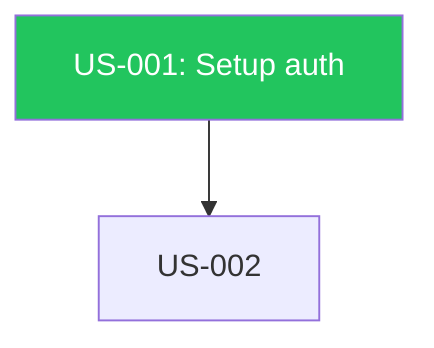

# Story Dependency Visualizer

## Input

Optional `$ARGUMENTS` story ID. If provided → show only transitive ancestors/descendants subgraph. If empty → full graph.

## Data Collection

Glob `prd/US-*.json`. For each: extract `id`, `title`, `dependencies`, `.stage` (top-level), `priority` via jq. Build adjacency list (depends-on + depended-by).

**Edge cases**: No stories → "No stories in `prd/`". Filtered story not found → list available. All complete → "Fully resolved."

## Output Sections

**1. Overview Table**: `| ID | Title | Stage | Priority | Dependencies |`

**2. Text Tree** (roots = no dependencies):
```
US-001 [complete] — Setup auth
  └── US-002 [build] — Add API
      └── US-003 [blocked] — Deploy infra
```

**3. Mermaid Flowchart**:

Offer to save to `flowchart/dependencies.mmd`.

**4. Critical Path**: Longest root-to-leaf chain. Compare with `.plan/dependencies.md` if exists.

**5. Ready to Run**: Stories with all deps `complete` and own stage `build`.

**6. Blocked Chains**: Stories blocked by incomplete upstream.
